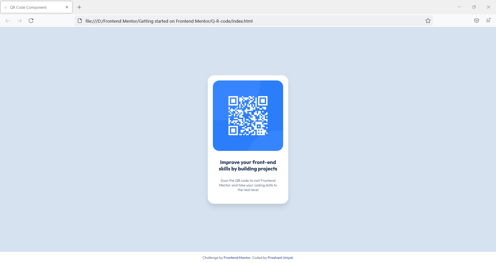

# Frontend Mentor - QR Code Component Solution

This is my solution to the [QR Code Component Challenge on Frontend Mentor](https://www.frontendmentor.io/challenges/qr-code-component-iux_sIO_H). The challenge involves building a visually accurate and responsive QR code component, helping to practice and improve frontend development skills.

## Table of Contents

- [Overview](#overview)
  - [Screenshot](#screenshot)
  - [Links](#links)
- [My Process](#my-process)
  - [Built With](#built-with)
  - [What I Learned](#what-i-learned)
  - [Continued Development](#continued-development)
  - [Useful Resources](#useful-resources)
- [Author](#author)
- [Acknowledgments](#acknowledgments)

## Overview

### Screenshot

### Links

- [Solution Repository](https://github.com/mod-prashant/Q-R-code)
- [Live Demo](https://q-r-code.vercel.app)

## My Process

### Built With

- Semantic HTML5 markup
- CSS custom properties
- Flexbox for layout

### What I Learned

During this project, I refined my skills in using CSS Flexbox for creating responsive layouts and gained a deeper understanding of applying CSS custom properties effectively.

### Continued Development

Moving forward, I aim to:
- Explore advanced CSS layout techniques like Grid.
- Enhance my knowledge of accessibility to improve the user experience.
- Experiment with CSS animations and transitions in similar projects.

### Useful Resources

- [w3schools](https://www.w3schools.com/) - A comprehensive resource for web development best practices and references.

## Author

- Portfolio - [Prashant Uniyal](https://resume8305.wordpress.com/)
- Frontend Mentor Profile - [@mod-prashant](https://www.frontendmentor.io/profile/mod-prashant)
- LinkedIn - [Prashant Uniyal](https://linkedin.com/in/prashant-uniyal-9ab235273/)

## Acknowledgments

I would like to thank the Frontend Mentor for providing this great learning opportunity.